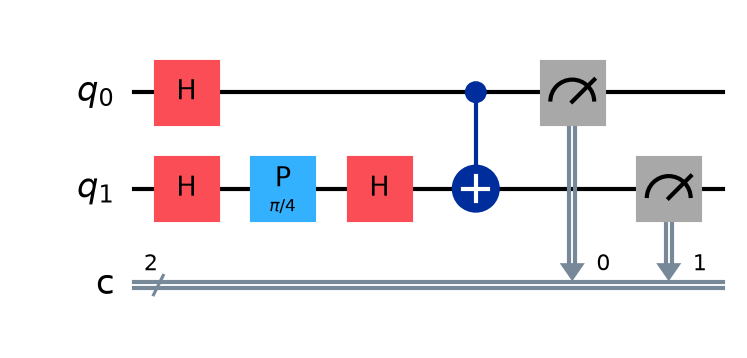
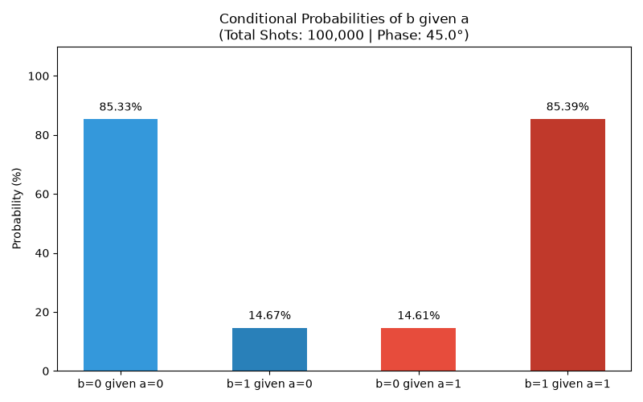

# รายงานการบ้าน 02: Remote-Controlled Randomness (ความสุ่มควบคุมระยะไกล)

นาย ชนม์ธนวัฒน์ แก้วกัณฑ์  

---

## 1. วัตถุประสงค์ของโปรแกรม (Objective)
การทดลองเชิงควอนตัมนี้จัดทำขึ้นเพื่อจำลอง ทวนสอบ และอธิบายปรากฏการณ์ **"ความสุ่มควอนตัมที่ถูกควบคุมระยะไกล" (Remote-Controlled Randomness)** ซึ่งเป็นผลลัพธ์มาจากการเหนี่ยวนำความพัวพันทางควอนตัม (Quantum Entanglement) ในคิวบิตคู่หนึ่ง ($a$ และ $b$)

เป้าหมายสำคัญของการทดลองคือการสร้างระบบคิวบิตที่พัวพันกันในลักษณะพิเศษ โดยเมื่อเราสุ่มวัดผล (READ) คิวบิตแรก ($a$) ได้ผลลัพธ์เป็น $0$ หรือ $1$ (โอกาสเกิด 50/50 เท่ากันตามธรรมชาติ) ผลการวัดนี้จะทำหน้าที่เป็นเสมือน "รีโมทคอนโทรล" ที่ส่งผลให้สถานะร่วมควอนตัมของระบบล่มสลายลง (Wavefunction Collapse) ทันที ส่งอิทธิพลระยะไกลไปปรับเปลี่ยนพฤติกรรมการแจกแจงความน่าจะเป็นของการวัดคิวบิตตัวที่สอง ($b$) ให้สลับสถิติโอกาสออก 1 ระหว่าง **15%** หรือ **85%** ตามผลการวัดของคิวบิตตัวคุมในจังหวะเวลานั้น โดยไม่ต้องอาศัยสายสื่อสารข้อมูลทั่วไปในการเปลี่ยนสถานะปลายทางแบบเรียลไทม์

---

## 2. แนวทางการเขียนโปรแกรมและจำลองระบบ (Implementation Approach)

### 2.1 การเตรียมสถานะและการจำลองวงจรเชิงควอนตัม
เราทำการจำลองวงจรควอนตัมขนาด 2 คิวบิต ประกอบด้วยคิวบิตควบคุม $a$ ($q_0$) และคิวบิตเป้าหมาย $b$ ($q_1$) โดยเก็บผลการวัดลงในบิตคลาสสิก $c_0$ และ $c_1$ ตามลำดับ โดยมีขั้นตอนลำดับเกตดังนี้:

1. **การเตรียมคิวบิตควบคุม $a$ ให้ซ้อนทับ:**
   เราใช้เกต Hadamard ($H$) บนคิวบิต $a$ เพื่อเปลี่ยนจากสถานะตั้งต้นให้กลายเป็นสถานะซ้อนทับ (Superposition) ทำให้คิวบิต $a$ มีโอกาสสุ่มวัดได้เป็น $0$ หรือ $1$ ในสัดส่วนเท่ากันครึ่งต่อครึ่ง (50/50)
2. **การจัดเตรียมระดับความสุ่มบนคิวบิตเป้าหมาย $b$:**
   เราต้องการให้คิวบิต $b$ มีระดับเปอร์เซ็นต์โอกาสในการสุ่มออก $1$ อยู่ที่ประมาณ $15\%$ (และออก $0$ อยู่ที่ประมาณ $85\%$) ก่อนนำไปผูกพัวพัน โดยใช้กระบวนการแทรกสอดผ่านการเรียงเกตสามตัวคือ:
   * รันเกต Hadamard ($H$) ตัวแรกเพื่อกระจายสถานะเป็นซ้อนทับ 50/50
   * รันเกตปรับเฟส (Phase Gate) ด้วยมุม $45$ องศา ($\pi/4$ เรเดียน) เพื่อหมุนเฟสสัมพัทธ์ของระบบคลื่นควอนตัมเล็กน้อย
   * รันเกต Hadamard ($H$) ตัวที่สองเพื่อให้คลื่นควอนตัมกลับมาแทรกสอดกันเอง ซึ่งจังหวะเฟสที่บิดไป 45 องศาจะขัดขวางไม่ให้หักล้างกันสมบูรณ์จนเหลือสถานะเริ่มแรก แต่จะเหนี่ยวนำให้เกิดสัดส่วนความน่าจะเป็นในการวัดค่าเป็น 15% และ 85% ตามลำดับ
3. **การเหนี่ยวนำความพัวพันด้วยเกต CNOT:**
   ใช้เกต CNOT โดยกำหนดให้คิวบิต $a$ เป็นตัวควบคุม และคิวบิต $b$ เป็นเป้าหมาย การเหนี่ยวนำนี้จะทำให้อัตราสถิติความน่าจะเป็นในการวัดผลลัพธ์ของคิวบิต $b$ ยุบตัวสลับฝั่งสัมพันธ์สอดคล้องตามคิวบิตควบคุม $a$ ทันทีเมื่อเกิดการวัดผล


### 2.2 ซอร์สโค้ดการสร้างวงจรด้วย Qiskit (Python)
วงจรควอนตัมสร้างขึ้นจากชุดคำสั่งหลักต่อไปนี้:

```python
# 1. จัดสรรควอนตัมและคลาสสิกรีจิสเตอร์
q = QuantumRegister(2, 'q')
c = ClassicalRegister(2, 'c')
qc = QuantumCircuit(q, c)

# 2. จัดการคิวบิตควบคุม a
qc.h(q[0])

# 3. จัดการคิวบิตเป้าหมาย b (H -> Phase -> H)
qc.h(q[1])
phase_radians = np.deg2rad(phase_degrees)
qc.p(phase_radians, q[1])  # ปรับเฟสตามมุมที่รับเข้ามาในหน่วยเรเดียน
qc.h(q[1])

# 4. เหนี่ยวนำความพัวพันเชิงควอนตัม
qc.cx(q[0], q[1])

# 5. วัดผลคิวบิตทั้งคู่
qc.measure(q[0], c[0])
qc.measure(q[1], c[1])
```

---

## 3. ความต้องการของระบบและวิธีการติดตั้ง (System Requirements & Installation)

### 3.1 ความต้องการของระบบ (System Requirements)
* **Python Environment:** Python เวอร์ชัน 3.10 ขึ้นไป
* **Libraries:** `qiskit==2.5.0`, `qiskit-aer==0.17.2`, `matplotlib`, `pylatexenc`, `numpy`

### 3.2 ขั้นตอนการเซตอัปและติดตั้ง (Installation Instructions)
ให้เปิดโปรแกรมเทอร์มินัล (Terminal) แล้วเข้าสู่โฟลเดอร์ `code/` จากนั้นพิมพ์คำสั่งตามลำดับต่อไปนี้:

```bash
# 1. สร้างสภาพแวดล้อมจำลอง (Virtual Environment)
python3 -m venv .venv

# 2. เปิดใช้งาน .venv ของ Python
source .venv/bin/activate

# 3. ติดตั้งแพ็กเกจไลบรารีที่จำเป็นทั้งหมด
pip install -r requirements.txt
```

---

## 4. ขั้นตอนและคำแนะนำในการรันซอร์สโค้ด (Execution Instructions)

เมื่อติดตั้งสภาพแวดล้อมเสร็จเรียบร้อย สามารถสั่งรันโปรแกรมจำลองหลักได้จากไดเรกทอรี `code/` ผ่านคำสั่งนี้:

```bash
python run_simulation.py
```

### การตั้งค่าปรับเปลี่ยนพารามิเตอร์เพิ่มเติม:
ในตัวสคริปต์ได้ออกแบบให้มี Argument Parser รองรับกรณีที่ต้องการปรับเปลี่ยนพารามิเตอร์การทดลองจาก Command Line:
* `--shots` (Default: 100000): ระบุจำนวนครั้งของการจำลองเพื่อทดสอบสถิติ
* `--phase` (Default: 45.0): ระบุมุมเฟส $\theta$ ของคิวบิต $b$ ในหน่วยองศา

```bash
# ตัวอย่าง: สั่งรันสุ่มวัดผล 20,000 รอบที่มุมเฟส 90 องศา
python run_simulation.py --shots 20000 --phase 90
```

---

## 5. รูปแบบข้อมูลนำเข้าและแสดงผลลัพธ์ (Input & Output Formats)

### 5.1 รูปแบบข้อมูลนำเข้า (Input Format)
โปรแกรมรับข้อมูลค่าคอนฟิกตัวเลขพารามิเตอร์ผ่านทางระบบ Argument ของคอมมานด์ไลน์ (หรือใช้ค่าตั้งต้นที่มีในระบบโดยอัตโนมัติหากไม่ป้อนค่า) ได้แก่ จำนวนรอบการทดลอง (Shots) และมุมองศาเฟส (Phase Angle)

### 5.2 รูปแบบข้อมูลแสดงผล (Output Format)
* **ผลลัพธ์บนหน้าจอคอนโซล (Console Output):** แสดงสถิติดิบ (Raw Counts) และรายละเอียดจำนวนครั้งพร้อมเปอร์เซ็นต์ของคิวบิตเป้าหมาย $b$ แยกตามกรณีผลลัพธ์ของคิวบิตควบคุม $a = 0$ และ $a = 1$
* **ไฟล์รูปภาพแสดงผลลัพธ์ (Graphical Outputs):**
  * `code/img_results/circuit.png`: ผังภาพวงจรควอนตัมจำลองที่สร้างจาก Qiskit
  * `code/img_results/histogram_{จำนวน shots}_shots.png`: ภาพกราฟแท่งเปรียบเทียบเปอร์เซ็นต์ค่า Conditional Probabilities พร้อมระบุจำนวน Shots ในชื่อไฟล์ภาพ

---

## 6. ตัวอย่างผลลัพธ์ที่ได้จากการรันจริงพร้อมการวิเคราะห์ (Example Results & Analysis)

### 6.1 ตัวอย่างรายงานผลการทดสอบเชิงปริมาณ (Shots = 100,000 | Phase = 45°)
จากการจำลองรันบน AerSimulator ผลสถิติดิบที่ได้คือ:
`Raw Counts: {'01': 7329, '10': 7313, '11': 42820, '00': 42538}` *(ใน Qiskit เรียงบิตคลาสสิกจากซ้ายไปขวาคือ b a)*

เมื่อนำข้อมูลดิบมาวิเคราะห์จำแนกตามเงื่อนไข (Conditional Probabilities):
1. **กรณีที่ผลการวัดคิวบิตควบคุม $a = 0$** (เกิดขึ้น 49,851 ครั้ง):
   * โอกาสพบ $b = 0$: **42,538 ครั้ง (85.33%)** *(ทางทฤษฎีคือ 85%)*
   * โอกาสพบ $b = 1$: **7,313 ครั้ง (14.67%)** *(ทางทฤษฎีคือ 15%)*
2. **กรณีที่ผลการวัดคิวบิตควบคุม $a = 1$** (เกิดขึ้น 50,149 ครั้ง):
   * โอกาสพบ $b = 0$: **7,329 ครั้ง (14.61%)** *(ทางทฤษฎีคือ 15%)*
   * โอกาสพบ $b = 1$: **42,820 ครั้ง (85.39%)** *(ทางทฤษฎีคือ 85%)*

ภาพผังวงจรควอนตัมและภาพกราฟแสดงการแจกแจงสถิติจากการจำลองจริงถูกบันทึกไว้ดังต่อไปนี้:



*รูปที่ 1: ผังวงจรควอนตัมสำหรับประมวลผล Remote-Controlled Randomness ด้วย Qiskit*



*รูปที่ 2: กราฟแท่งแสดงอัตราความน่าจะเป็นแบบมีเงื่อนไขของ b กำหนดตามผลการวัดของ a (Total Shots: 100,000)*
